# GoBabyGo Joystick Project
### Wichita State University 2024
### Everett Kernen and Jackson Truitt
-----------
-----------

This document aims to help guide GoBabyGo teams through the steps of building a joystick controlled ride-on car. The joystick system was built with this specific model in mind, but could be adapted to other vehicles.

This design is specifically only the electronics and steering components of a GBG build. Any seating adjustments or joystick mounting mechanisms will change for each child and thus must be designed with the individual child in mind.

If you have any questions regarding this project, feel free to open an issue in this repository. I will respond as soon as I can.

## TODO:
 - insert length of carriage bolts and add the links to the BOM
 - create a steering mechanism using a high-torque servo rather than a linear actuator. This would lead to significant savings, as the linear actuator is the single most expensive component other than the car

## Table of Contents
-----------
- [Bill of Materials](#bill-of-materials)
     - [Electronics BOM](#electronics-bom)
     - [Steering mechanism BOM](#steering-assembly-bom)
- [Unpacking the car](#unpacking-your-car-and-components)
- [Preparing the car](#preparing-the-car)
     - [Removal of steering column and motor](#removal-of-steering-column-and-motor)
     - [Removal of steering linkage](#removal-of-steering-linkage)
- [Steering mechanism assembly](#steering-mechanism-assembly)
     - [Steering linkage assembly](#steering-linkage-assembly)
     - [Linear actuator attachment](#linear-actuator-attachment)
     - [Steering linkage installation](#steering-linkage-installation)
     - [Finished steering mechanism](#steering-mechanism-overview)
- [Electronics and programming](#electronics-and-programming)
     - [Preparation](#preparation)
     - [Wiring power](#power)
     - [Power bus and motor controller](#power-bus-and-motor-controller)
     - [PCB preparation](#pcb-preparation)
     - [PCB assembly](#pcb-soldering)
     - [Programming the arduino microcontroller](#programming-the-arduino)
     - **[Parental controls](#parental-controls)**
     - [Testing and fine tuning](#testing-and-fine-tuning)
     - [Finished electronics](#final-engine-bay-appearance)
- [Troubleshooting](#troubleshooting)

## Bill of Materials
-----------
The following tables are lists of all parts required for the electronic and mechanical components of this joystick system. Links and quantities are included.

Quantities are how many per car, not how many packs to purchase. Double check if the link is a multipack.

*Note that if you are at a University and your University has a GBG organization, they may already have many of these components. Check before you purchase. This is particularly true for Wichita State*

**__Vehicle__: [Best Choice Products Kids 12V Ride On Truck, Battery Powered Toy Car w/Spring Suspension, Remote Control, 3 Speeds, LED Lights, Bluetooth - Light Blue](https://www.amazon.com/gp/product/B0C7JK9HNR/ref=ask_ql_qh_dp_hza?th=1)\
This "Jeep" is the one we used and configured the steering mechanism for. Other ride-on vehicles we have seen use extremely similar electronics, so the only difference should be the steering**

### Electronics BOM
| **Item**                         | **Link**                                                                                                                                                           | **Quantity** |   **Additional Notes** | **Item label in case of dead link**   |
| ---                              | ---                                                                                                                                                                | ---          | ---                    | ----                                  |
| Kill Switch                      | [Link](https://www.amazon.com/Toggle-Switches-Rocker-Switch-Waterproof/dp/B07WW3WW3F)                                                                              | 1            | 8 pack | Toggle Switches 8 Pack 2 Pin ON Off SPST Car Rocker Toggle Switches, 20A Heavy Duty Waterproof Toggle Witch
| Arduino Nano Every w/ Headers    | [Link](https://store-usa.arduino.cc/collections/boards-modules/products/arduino-nano-every-with-headers)                                                           | 1            | Microcontroller, brains of the operation | Arduino Nano Every with Headers
| Motor Controller                 | [Link](https://www.amazon.com/HOBBYWING-QUICRUN-Waterproof-Brushed-Motors/dp/B07NYBF6MQ)                                                                           | 1            | | HOBBYWING QUICRUN 880 ESC, Waterproof ESC for Dual Brushed Motors
| Motor Controller Programmer      | [Link](https://www.hobbywingdirect.com/products/led-pc2c?variant=172030922)                                                                                        | 1            | Only one is ever needed for a GBG org. Check to see if you have one already | HOBBYWING LED Program Card
| Joystick                         | [Link](https://www.amazon.com/Acxico-Joystick-Potentiometer-JH-D202X-R2-Thermistor/dp/B09JZ8ZV4L)                                                                  | 1            | | Acxico 1Pcs Joystick Potentiometer JH-D202X-R2/R4 5K 10K ohm 2-axis Sealed PTZ Thermistor
| RC Controller                    | [Link](https://www.amazon.com/DUMBORC-Transmitter-Receiver-Controller-400m-500m/dp/B07RR81GSB)                                                                     | 1            | used for parental override over the joystick controls | X4 4CH RC Radio System Transmitter and Receiver X6F 2.4ghz Remote Controller for RC Car Boat Tanks(Distance 400m-500m) Controller Transmitter
| 30A bus bar                      | [Link](https://www.amazon.com/OONO-Position-Terminal-Distribution-Module/dp/B09D3BV22M)                                                                            | 1            | Power distribution | OONO 30Amp 48V 2x6 Position Terminal Block Distribution Module 
| 4ft servo wires                  | [Link](https://www.readymaderc.com/products/details/120cm-48in-jr-twisted-22awg-servo-cable?srsltid=AfmBOooBtGZkchE-u-FVPZSh1Mha9t9dLRYeGN2BnarDRjaqf-3A2QVKya4)   | 3            | Connect the joystick to the arduino through the car, so lots of length is good | 120cm (48 inch) JR Style 22AWG Twisted Servo Extension Cable
| Speed control potentiometers     | [Link](https://www.amazon.com/Uxcell-a15040700ux0380-Terminals-Linear-Potentiometer/dp/B019I13X5K)                                                                 | 1            | | uxcell 5pcs 10K OHM 3 Terminal Linear Taper Rotary Audio B Type Potentiometer Height 36cm 
| Steering control potentiometers  | [Link](https://www.digikey.com/en/products/detail/bourns-inc/3296W-1-103LF/1088045)                                                                                | 2            | Dial in steering center and range | Bourns 3296W-1-103LF
| 15 pin female header pins        | [Link](https://www.amazon.com/2-54mm-Female-Single-Straight-Header/dp/B07VP63Z78)                                                                                  | 2            | Connect the arduino to the PCB | 10 pcs. 15 Pin 2.54mm Pitch 15 Pin Female Single Row Straight Header Strip PH:8.5mm 
| Male header pins                 | [Link](https://www.amazon.com/HiLetgo-20pcs-2-54mm-Single-Header/dp/B07R5QDL8D)                                                                                    | 1            | Connect everything else to the PCB. You'll break them off in 3 pin chunks, of which you'll need 7. 21 pins total | HiLetgo 20pcs 40P 2.54mm Pitch Single Row Pin Header Strip 40Pin 2.54mm Pitch 
| Spade connectors                 | [Link](https://www.amazon.com/Connectors-Shrink-Terminals-Female-MENTBERY/dp/B0BFDJNK91?source=ps-sl-shoppingads-lpcontext&ref_=fplfs&smid=A2TBO4E1CS6T20&th=1)    | 4            | Connect the motor controller wires to the motor wires. | 150 PCS Spade Connectors, Heat Shrink Spade Terminals 22-10 AWG, Wire Connectors Male and Female by MENTBERY 
| PCB                              | none                                                                                                                                                               | 1            | See notes below | See notes below

*You will also need access to a soldering iron and a couple feet of 14AWG wire*

### Steering Assembly BOM
| **Item**                              | **Link**                                                                                          | **Quantity** | **Additional Notes**   |
| ---                                   | ---                                                                                               | ---          | ---                    |
| Linear Actuator (part 13)             | [Link](https://www.servocity.com/4-stroke-25-lb-thrust-linear-servo/)                             | 1 | Heavy-Duty Linear Servo (Position Control, 12-24V, 33lb Thrust, 1.7"/sec, 4" Stroke). Used for steering. At $300, this is by far the biggest opportunity to reduce costs. Unfortunately, we did not have time to test cheaper options, like [this servo](https://www.amazon.com/GoolRC-Digital-Torque-Waterproof-Replacements/dp/B0B5H4MWZG)
| Mounting bracket (part 4)             | [Link](https://www.servocity.com/universal-mounting-bracket-for-heavy-duty-linear-actuator/)      | 1 | Universal Mounting Bracket for Heavy-Duty Linear Actuator
| 1" square aluminum tube               |                                                                                                   |   |                                   |
| 5" Threaded rod end bolt (part 5)     | [Link](https://www.mcmaster.com/2440K41/)                                                         | 1 | High-Strength Fully Threaded Rod End Bolt. 3/8"-16 shank thread, 5" shank length
| 4" Threaded rod end bolt (part 6)     | [Link](https://www.mcmaster.com/2440K78/)                                                         | 1 | High-Strength Fully Threaded Rod End Bolt. 3/8"-16 shank thread, 4" shank length
| Internal threaded rod (part 7)        | [Link](https://www.mcmaster.com/7417N87/)                                                         | 1 | Internally Threaded Connecting Rod. 18-8 Stainless Steel, 3/8"-16 thread, 12" length
| 3/8" Shoulder screw (part 8)          | [Link](https://www.mcmaster.com/91259A481/)                                                       | 1 | Alloy Steel Shoulder Screw. 3/8" shoulder diameter, 7/16" shoulder length, 5/16"-18 thread
| 5/16 Shoulder screw (part 15)         | [Link](https://www.mcmaster.com/91273A183/)                                                       | 1 | Same-Size Thread 18-8 Stainless Steel Shoulder Screew. 5/16" shoulder diameter, 3" shoulder length, 5/16"-18 thread
| 3/8" Washer (part 9)                  | [Link](https://www.mcmaster.com/92141A031/)                                                       | 1 | 18-8 Stainless Steel Washer. For 3/8" screw size. 0.875" outer diameter
| 5/16" Washer (part 12)                | [Link](https://www.mcmaster.com/92141A030/)                                                       | 2 | 18-8 Stainless Steel Washer. For 5/16" screw size. 0.75" outer diameter
| Hex Nut (part 10)                     | [Link](https://www.mcmaster.com/95462A031/)                                                       | 2 | Medium-Strength Steel Hex Nut. Grade 5, Zinc-plated. 3/8"-16 thread
| Locking Hex Nut (part 11)             | [Link](https://www.mcmaster.com/95615A160/)                                                       | 2 | Medium-Strength Steel Nylon-Insert Locknut. Grade 5, Zinc-plated. 5/16"-18 thread
| 1.75" Aluminum Spacer (part 16)       | [Link](https://www.mcmaster.com/92511A108/)                                                       | 1 | Aluminum Unthreaded Spacer. For 5/16" screw size. 1.75" length. 0.75" outer diameter

* PCB
     - You can upload the attached [gerber file](/GBG_Joystick_PCB_v4.zip) to a PCB manufacturer of your choice (PCBWay, JLCPCB, among others). You can also see and modify the [KiCAD files](/KiCAD/) and export from there.
     - Alternatively, you could build this on a breadboard or solder all wires together. If you do that, I highly recommend you reference the [schematic](/KiCAD/KiCAD.kicad_sch).

## Unpacking your car and components
-----------
- Once you get your vehicle, unpack the car and inspect it to ensure all the pieces are present and there is no damage to the vehicle
- Sort the componets, both electrical and mechanical, into two areas according to the BOM
- You don't need to assemble the vehicle at this point, as several components will be removed

## Preparing the car 
-----------

### Removal of steering column and motor

1. Using a hammer and punch, push out the silver pin on top of the steering column that holds the steering wheel adapter to the steering column. The pin should come out with medium force
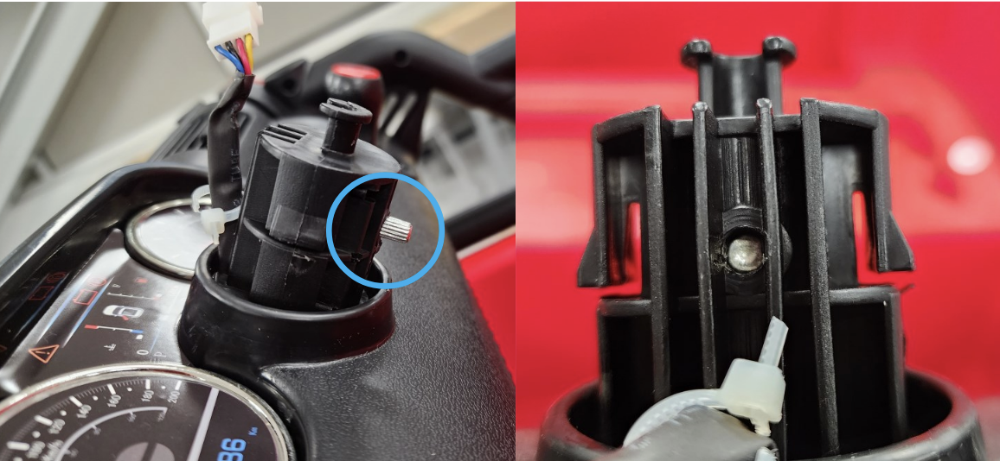
2. With the pin removed, the black cap that held the pin in should be able to be removed easily by pulling it up and away from the vehicle. This will leave a hole in the dashboard
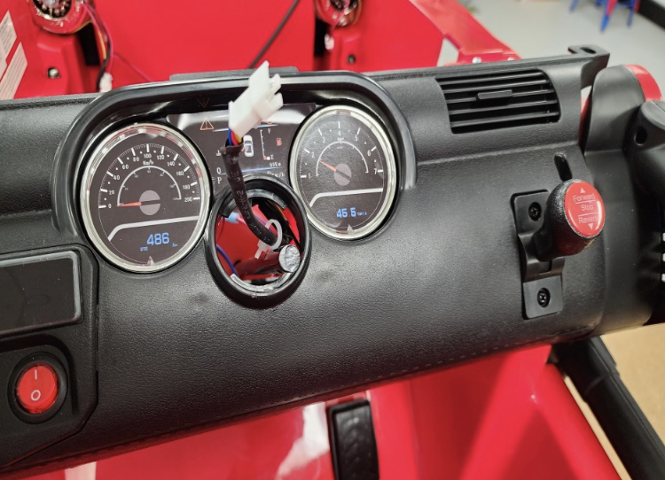
3. Now that the pin and black retaining cap are removed, drop the steering column (circled in blue) out of the vehicle through the bottom
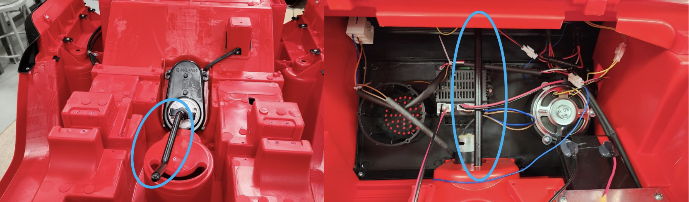
4. Remove the gearbox from the bottom of the vehicle by first unplugging it from the existing car controller, then dropping it out of the vehicle. The bottom of the car should now look like the following photo
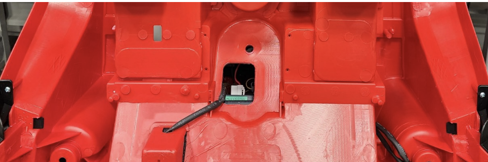
5. Following the manufacturers instructions, install the front steering axle and suspension. The bottom of the car should end up like the following
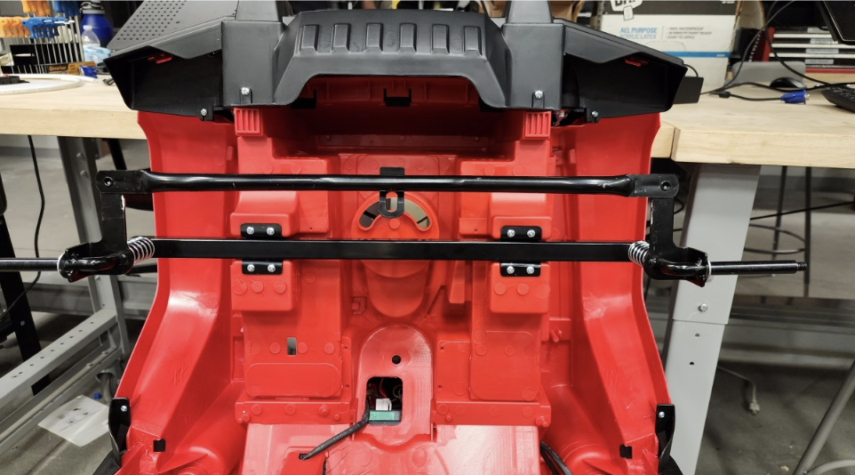

### Removal of steering linkage

1. The steering linkage (circled in yellow) that connects the right and left front wheel mounts needs to be removed. To do this, the pins that connect the linkage (circled in blue) should be drilled out
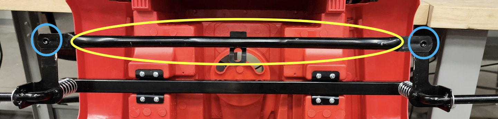
2. Using a 5/16" drill bit, slowly drill the pins out. When complete, the linkage will be disconnected as shown below. 
     - *Note: drill slowly with light to medium pressure and use cutting oil to ensure you don't damage or break the drill bit. You may need to hold the pin using pliers to ensure it does not slip and rotate during drilling*
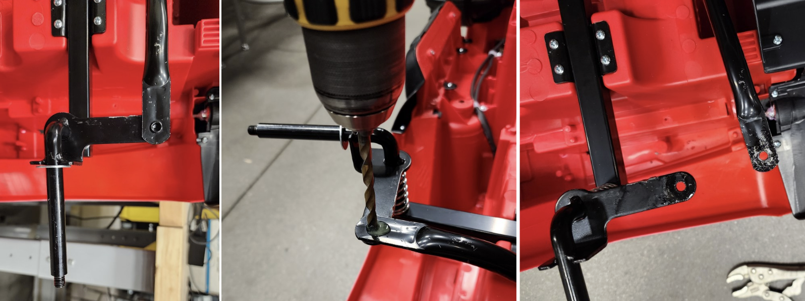
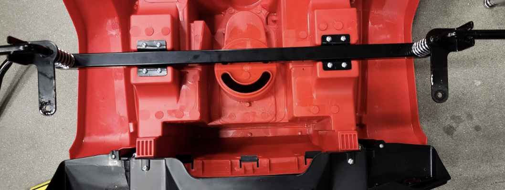

## Steering mechanism assembly
-----------

During this process, please reference the final assembly and exploded view below. You may also reference the assembly video [here](https://www.youtube.com/watch?v=7GvAFjcBryw)
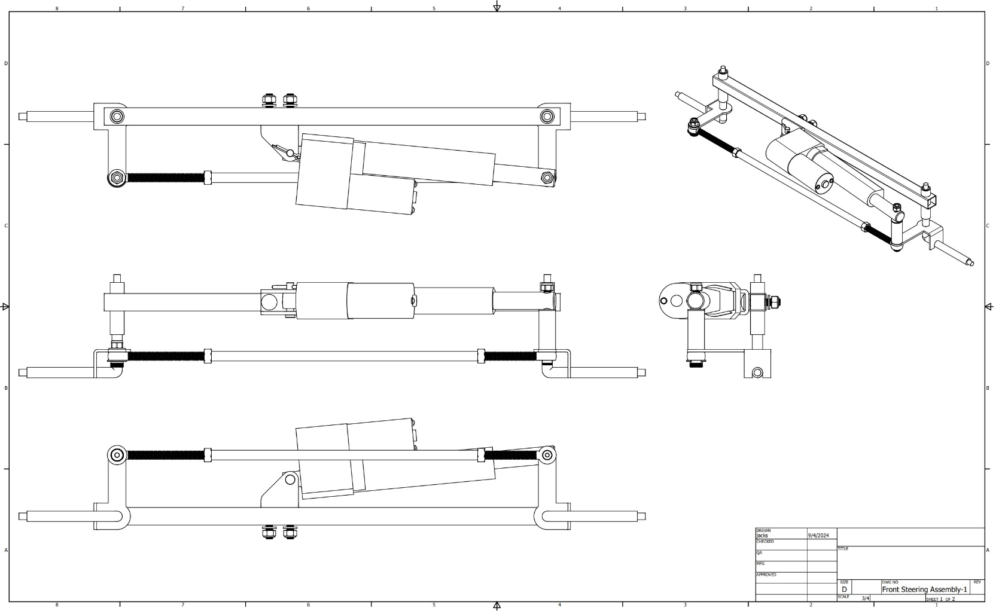
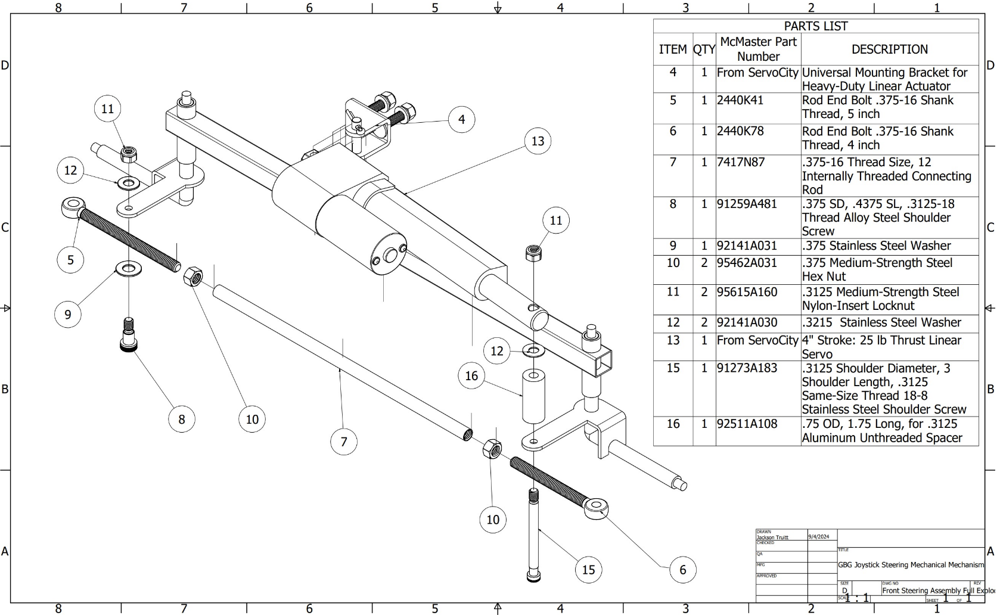

### Steering linkage assembly
1. Thread one hex nut (part 10) onto each of the threaded rod end bolts (parts 5 and 6) about 0.875 inches
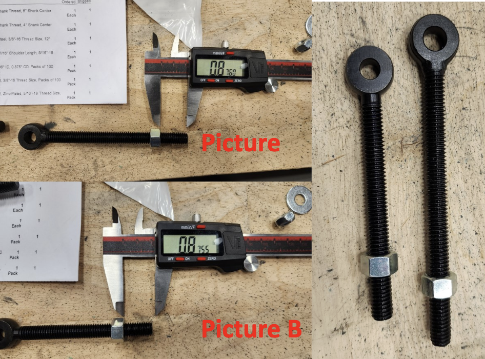
2. Take the internal threaded rod (part 7) and screw the bolts into each side until the rod touches the nuts. Then, tighten each nut into the rod to create jam nuts
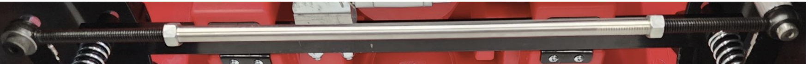

### Linear actuator attachment
1. Cut a piece of 1" square tubing to the length of the mounting bracket (part 4). This should be about 1.7 inches
2. Copy the location of the holes on the mounting bracket to the square tube, then drill those holes using a 5/16" drill bit
3. Scribe a line 7 inches from the left axle bar
4. Align the mounting bracket to this scribe line and mark the holes, then drill those holes using a 5/16" drill bit
5. Using **insert length here** 5/16" carriage bolts, mount the linear actuator mount to the car with the 1" aluminum square tube between the mount and vehicle crossbar
6. Using the supplied pin and retaining clip, mount the Linear Actuator (part 13) to the mounting bracket as shown below. The linear actuator should face to the vehicle's left side.
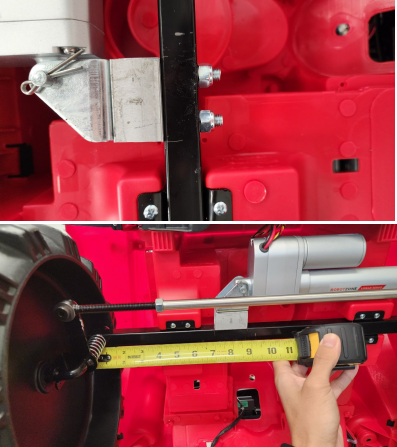
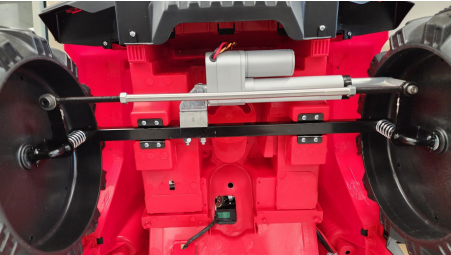

### Steering linkage installation
**Note: do a dry fit before using the locking nut to confirm the distance between wheels is correct and the wheels will be aligned properly after installation. To change the length, simply screw/unscrew the connecting rod ends and re-tighten the jam nut.** 
1. On the side opposite the linear actuator, install the following in order from bottom to top
     - 3/8" shoulder screw (part 8)
     - 3/8" washer (part 9)
     - 5" connecting rod end (part 5)
     - Vehicle steering carriage
     - 3/8" washer (part 9)
     - 5/16" locking nut (part 11)
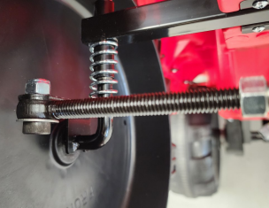
2. On the side nearest the linear actuator, install the following in order from bottom to top
     - 5/16" shoulder screw (part 15)
     - 4" connecting rod end (part 6)
     - Vehicle steering carriage
     - 5/16", 1.75" aluminum spacer (part 16)
     - 3/8" washer (part 9)
     - Linear actuator (part 13)
     - 5/16" locking nut (part 11)
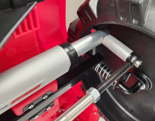

## Steering mechanism overview
At this point, the steering mechanism should be fully installed as shown in the picture below. You may need to drill a hole in the front of the "engine bay" to run the linear actuator wires.
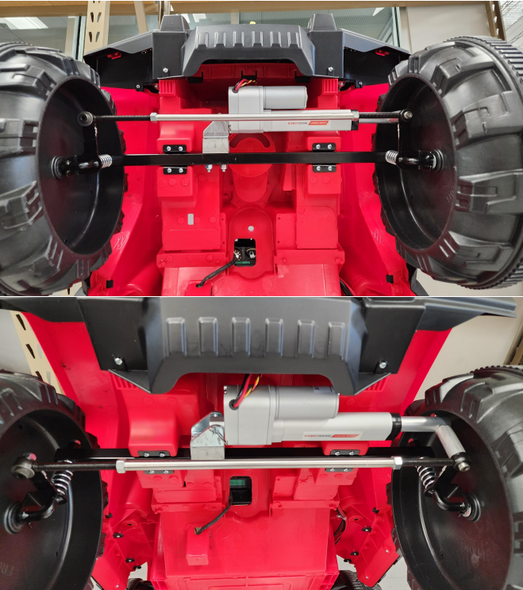

## Electronics and programming
-----------

The code to upload to the Arduino is in the Arduino folder

**PCB information**
- You can upload `GBG_Joystick_PCB_v4.zip` to a PCB manufacturer of your choice (PCBWay, JLCPCB, DKRed, among others) to get multiple PCBs printed for reasonably cheap.
- If you want to modify the PCB or schematic, all the KiCAD files are in the KiCAD folder
- Alternatively, you could build this on a breadboard or solder. In that case, you can reference the schematic either in KiCAD or in the [images folder](images/_Schematic.png)

### Preparation
1. After assembling your vehicle, the "engine bay" will look like the following. It looks like (and is) a jumbled mess of wires, but the components relevant to us are outlined.

2. Before doing anything, disconnect the battery, wires outlined in yellow
3. Double check you've disconnected the battery
3. Disconnect the green connector. It leads to the motors which power the car
4. Disconnect the steering motor, if you did not already do so in the steering mechanism assembly. The wires are typically blue and brown.

### Power
1. Cut a small board to place your components on. You could use MDF or cardboard
2. Gather your 30A bus, a spool of wire (14-18AWG), and your kill switch
3. Cut the orange wires about three inches from the connector. Again, make sure it is not connected to the battery
4. Strip all four wires about a quarter of an inch
5. Take the red wire on the orange connector side and crimp on a spade connector that fits the wire gauge. Once crimped, pull to ensure security
6. From your 14-18AWG spool of wire, strip the same amount from two wires and crimp the opposite spade connector on one, then connect the two spade connectors together
7. Run both wires to the rear of the car, running the wire along the bottom or side of the car to keep things tidy
8. Use wire nuts or spade connectors to connect the two wires to your kill switch
9. Use a drill and the accompanying nuts that came with the switch to attach it securely to the rear of the car
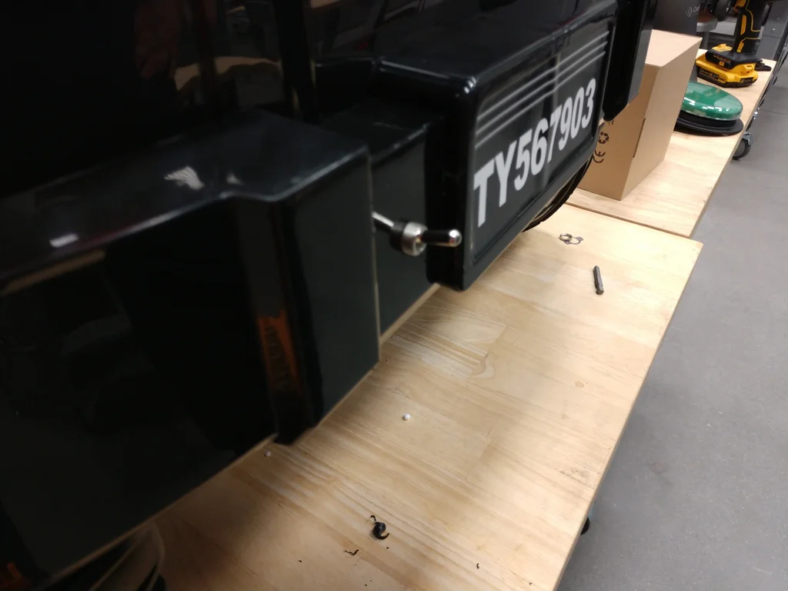
10. Take your 30A bus and screw into block A the remaining wire from the kill switch connection, and into block B the black wire from the orange connector
11. Run the linear actuator power wires into the "engine bay," then screw red into A and black into B

*Note that the motor controller here is what powers the arduino and PCB. It will act as our voltage regulator, giving the arduino a clean 5 volts*

### Power bus and motor controller
1. Ensure the battery remains disconnected, if you connected it to test kill switch continuity
2. Connect the wires previously connected to the orange connector into the 30A bus, with red going to A and black going to B
3. Cut and strip the red and black power wires from your motor controller and screw red into A, black into B
4. Cut and strip one blue wire and one yellow wire, then crimp on spade connectors. Use the same spade connector for both
5. Cut and strip the two wires leading to the rear motors. In the picture before, this connector is outlined in green. Crimp the opposite spade connector onto both
6. Connect the blue/yellow wires and the motor wires. Don't worry about if they're backwards, you can just swap them later when we test if so

*Note that the motor controller may come with the proper configuration to power the rear motors. If not, connect it to the Motor Controller Programmer and follow the instructions there to program your motor controller as desired*

### PCB preparation
First, we need to solder pins to the joystick. You may have noticed we specified 4 servo wires in the BOM - we will be soldering two of those wires to the joystick, then the other two wires will connect those wires to the PCB\
This is easily the most difficult soldering job in this project, so be prepared. If you haven't soldered before, consider asking for help or advice
1. Grab the joystick and two servo wires. Cut the wires about two inches above the female connector, then strip about 1/8"
2. Drop a small piece of heat-shrink tubing over each of the 6 individual wires, then solder each wire to the joystick leads
3. Move the heat shrink tubing over the solders and shrink them into place, protecting the solder joints and preventing them from shorting to each other
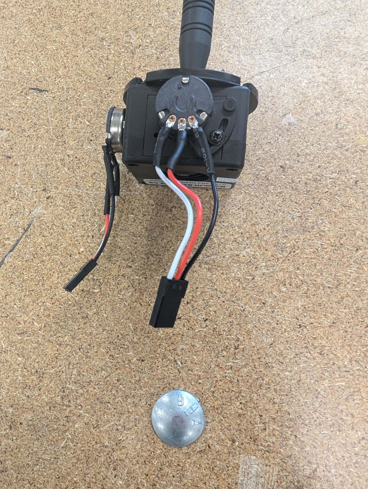

*Don't worry about the orientation. We can just turn the wires around when connecting to the PCB if necessary*

### PCB soldering
This part of the soldering should be significantly easier, as all components will slot in
1. Gather your PCB, two 15-pin female headers, seven 3-pin male headers, and all three potentiometers
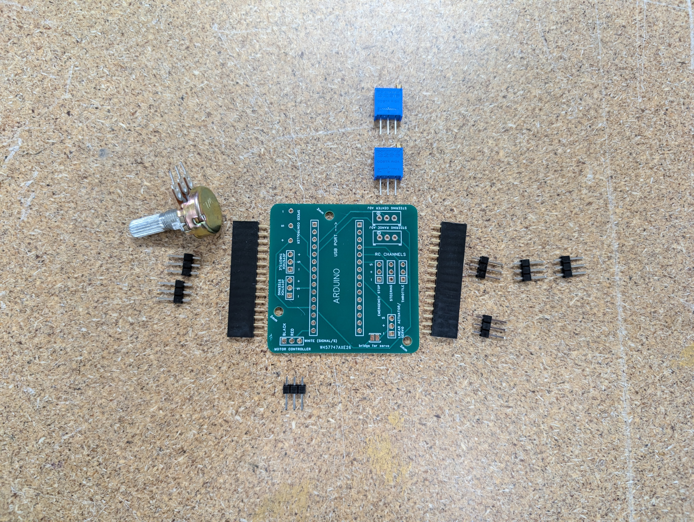
2. Solder all components from the underside. When soldering the 15-pin headers, we recommend putting the arduino into the headers to ensure the two headers stay aligned
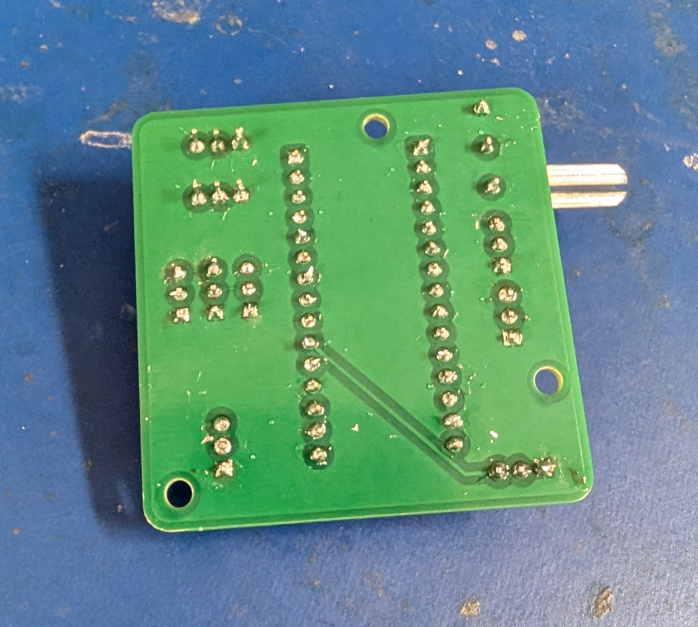
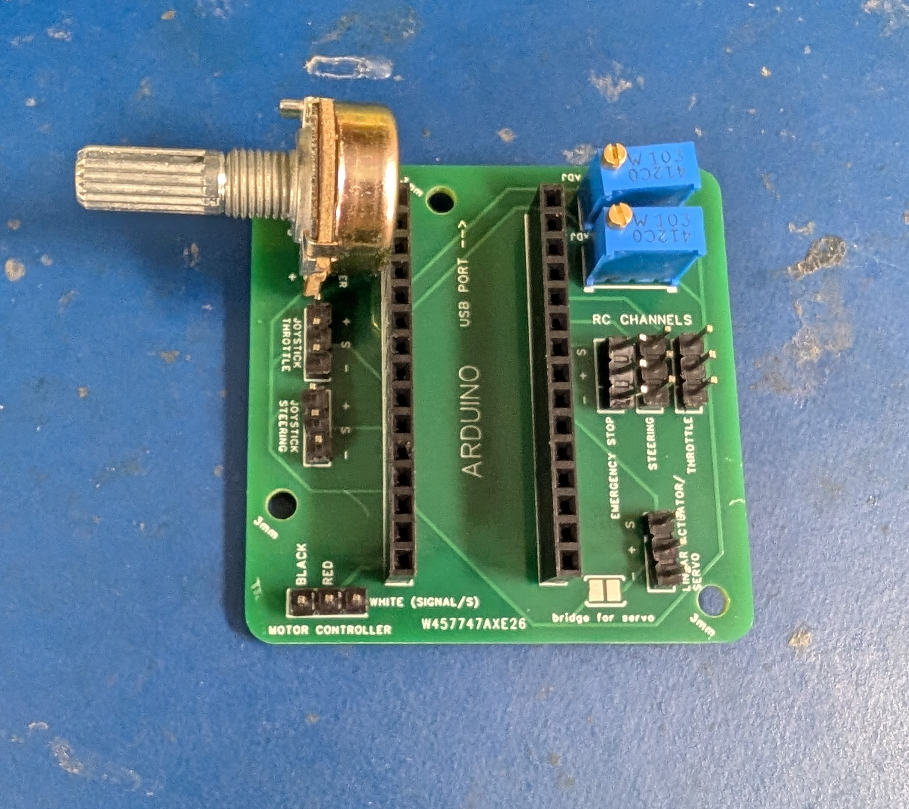
3. Plug all components into the PCB!
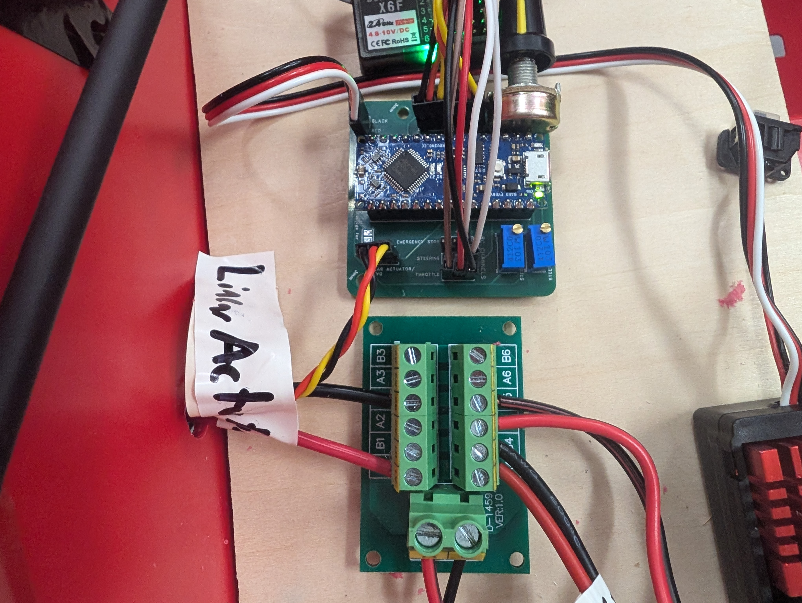

### Programming the arduino
1. Open the [Arduino sketch](/Arduino/Arduino.ino) in the [Arduino IDE](https://www.arduino.cc/en/software) on a computer
2. Connect the arduino to your computer via a USB cable, then flash the program to the arduino

### Parental controls
Parental controls are achieved via an RC controller. The controller sends instructions to the arduino microcontroller, which then override any input from the joystick.

There are three controls available to parents. 
1. The trigger will move the car forward or backward and will override forward/backward input from the joystick. It will __not__ override steering from the joystick unless the RC wheel is also turned
2. The wheel will steer the car and override left/right input from the joystick. It will __not__ override forward/backward input from the joystick unless the RC trigger is also activated
3. The blue button on the RC handle is an Emergency Stop. It will prevent the car from accepting any input from either the joystick or RC controller

*Note that this project also includes a kill switch that will shut the car down, if within arm's reach or when storing. The kill switch is functionally equivalent to unplugging the battery*

To set up the RC controls, grab the RC receiver and place it near the PCB. Tape the antenna where there will be little interference. Run jumper wires from the receiver to the PCB according to this diagram

### Testing and fine tuning
1. Use the 4 foot extension wires to connect the joystick to the PCB. Plug the battery in and flip the kill switch on
2. If nothing looks amiss, turn the joystick in all directions. Turn the joystick in your hand until the directions are correct. If one of two axes are flipped, simply unplug the connector from the PCB and turn it around
3. The vehicle should now have steering and motors functional
4. To increase or reduce speed, turn the speed potentiometer until you are satisfied. Turned all the way to the right will give speed equivalent to how it arrived, turning counterclockwise will reduce the top speed
5. Next, flip the car over or get into a position you can see the steering. It is likely not centered or has too wide/narrow a steering range. To fix this, turn the steering center and range adjustment potentiometers with a small screwdriver and test by moving the joystick in both directions to ensure it does not hit anything in the wheel bay and returns to center as expected
6. Finally, test the RC controller. Ensure the trigger, wheel, and emergency stops work as intended. If it has a different range or center than the joystick, open the top flap and adjust the knobs until they are equivalent

### Final engine bay appearance
- Power comes out of the battery positive terminal (red wire), through the blue wire nut and out to the kill switch, returning to the 30A bus side A.
- From there, power goes out to the motor controller and the linear actuator (ignore the extraneous wires leaving the frame in the bottom left)
- The motor controller sends power to the rear motors via the blue and yellow wires connecting through the spade connectors. Two wires are left unconnected. The motor controller both powers the arduino and is controlled by it
- The arduino receives power from the motor controller and, receiving signals from the configuration potentiometers, joystick, and RC receiver, controls the motors and linear actuator through servo wires

## Troubleshooting
If the car does not move when turned on, check that the RC controller is on. Occasionally, the RC receiver may, on start, send a signal that the Emergency Stop is on. Turning the controller on sends the proper signal to the receiver

Ensure all components are fully seated into their connectors

Ensure the solder joints on the PCB make a proper connection.

If none of these work or if the vehicle motors/steering is wonky, connect the arduino to your computer and read the Serial Monitor. Check that the values there match up generally to what's written in the code. If you have trouble parsing the code, please feel free to open an issue in this github repo.
