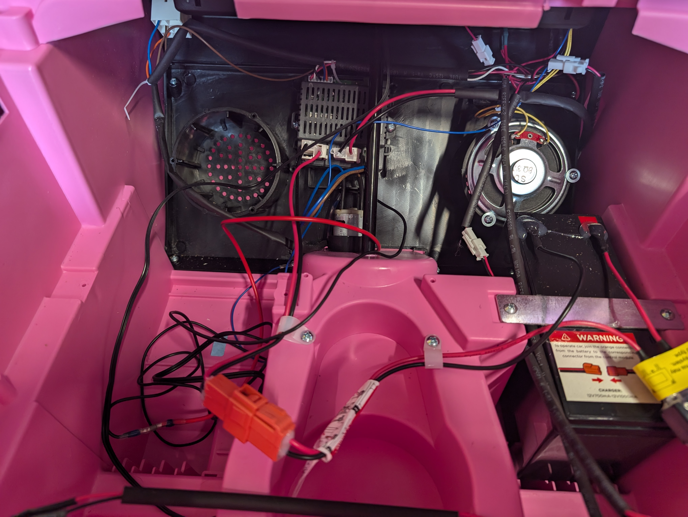
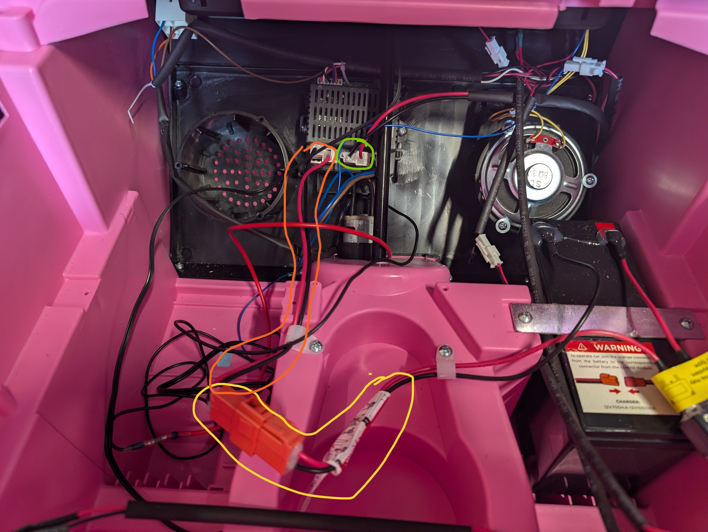
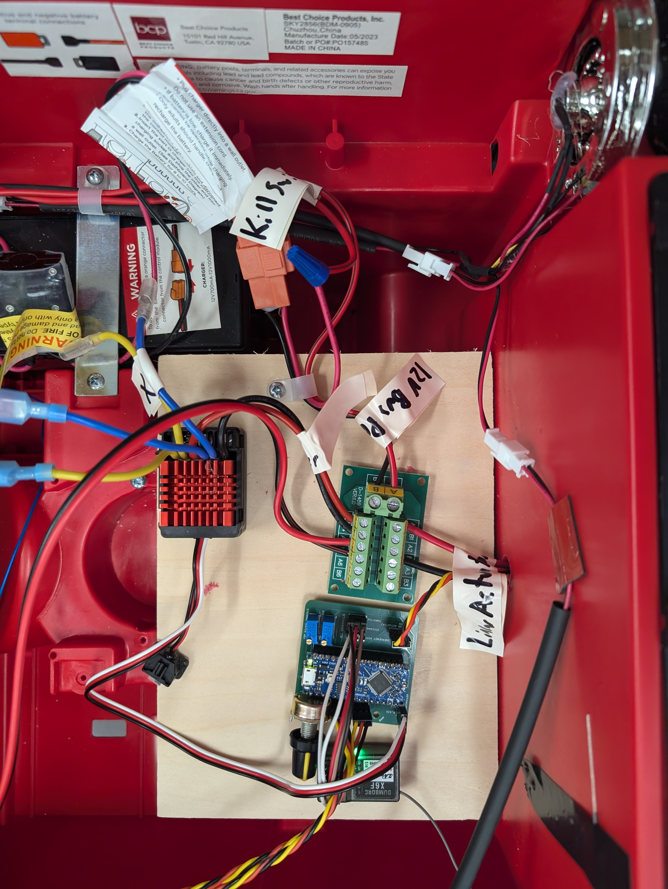
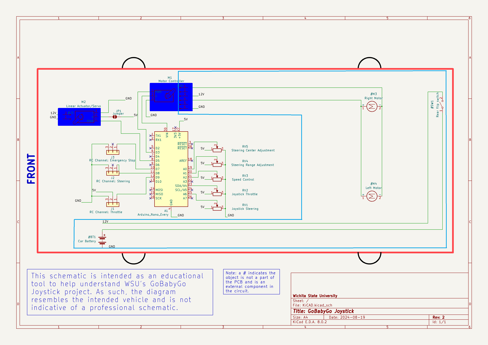
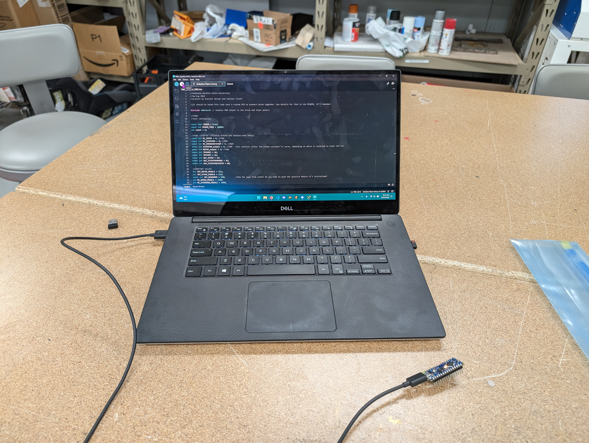
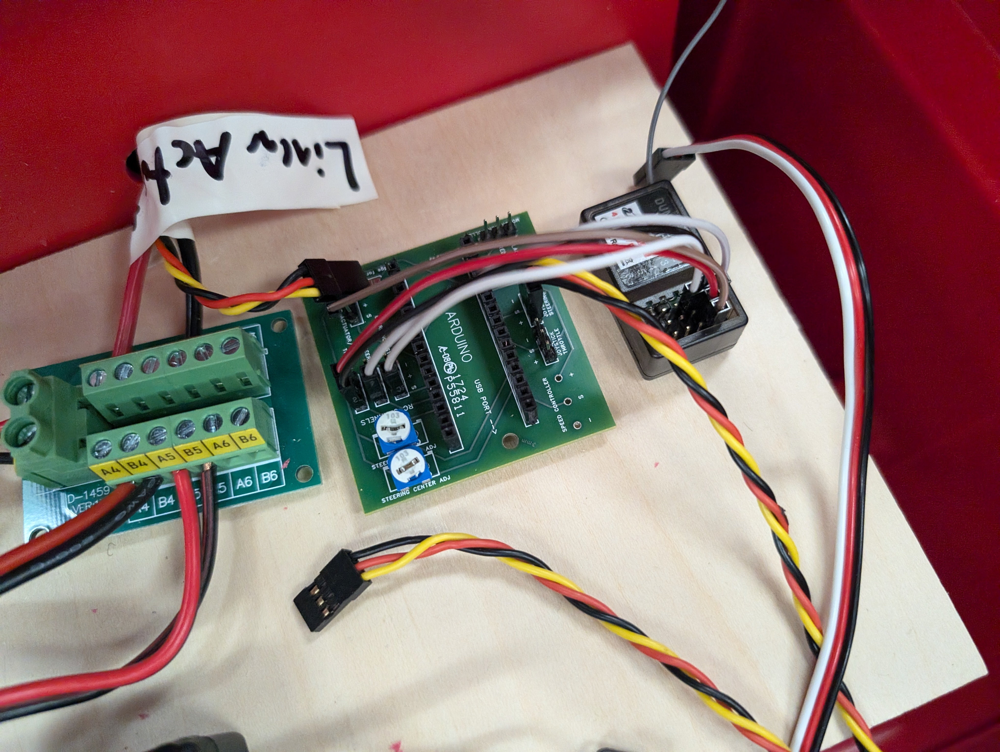
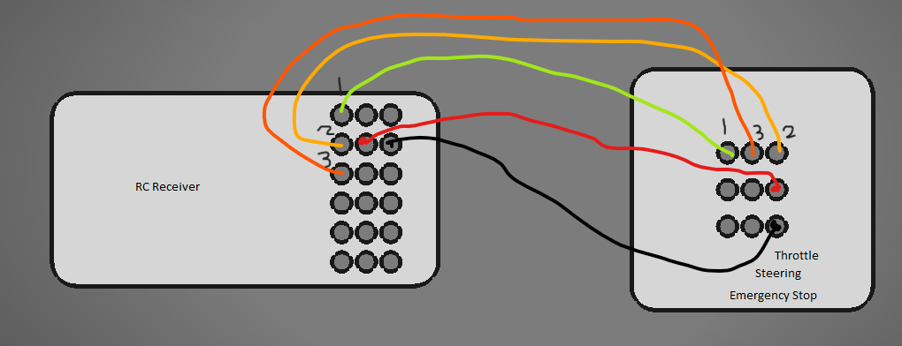

# GoBabyGo Joystick Project
### Wichita State University 2024
### Everett Kernen and Jackson Truitt
-----------
-----------

This document aims to help guide GoBabyGo teams through the steps of building a joystick controlled ride-on car. The joystick system was built with this specific model in mind, but could be adapted to other vehicles.

This design is specifically only the electronics and steering components of a GBG build. Any seating adjustments or joystick mounting mechanisms will change for each child and thus must be designed with the individual child in mind.

If you have any questions regarding this project, feel free to open an issue in this repository. I will respond as soon as I can.

## TODO
* add motor controller programmer details
* add linear actuator installation
* add images

## Table of Contents
- [Bill of Materials](#bill-of-materials)
- [Unpacking the car](#unpacking-your-car-and-components)
- [Preparing the car](#preparing-the-car)
- [Steering mechanism assembly](#steering-mechanism-assembly)

## Bill of Materials
-----------
The following tables are lists of all parts required for the electronic and mechanical components of this joystick system. Links and quantities are included.

Quantities are how many per car, not how many packs to purchase. Double check if the link is a multipack.

*Note that if you are at a University and your University has a GBG organization, they may already have many of these components. Check before you purchase. This is particularly true for Wichita State*

### Electronics BOM
| **Item**                         | **Link**                                                                                                                                                           | **Quantity** |   **Additional Notes** | **Item label in case of dead link**   |
| ---                              | ---                                                                                                                                                                | ---          | ---                    | ----                                  |
| Vehicle                          | [Link](https://www.amazon.com/gp/product/B0C7JK9HNR/ref=ask_ql_qh_dp_hza?th=1)                                                                                     | 1            | This "Jeep" is the one we used and configured the steering mechanism for. Other ride-on vehicles we have seen use extremely similar electronics, so the only difference should be the steering | Best Choice Products Kids 12V Ride On Truck, Battery Powered Toy Car w/Spring Suspension, Remote Control, 3 Speeds, LED Lights, Bluetooth - Light Blue
| Kill Switch                      | [Link](https://www.amazon.com/Toggle-Switches-Rocker-Switch-Waterproof/dp/B07WW3WW3F)                                                                              | 1            | 8 pack | Toggle Switches 8 Pack 2 Pin ON Off SPST Car Rocker Toggle Switches, 20A Heavy Duty Waterproof Toggle Witch
| Arduino Nano Every w/ Headers    | [Link](https://store-usa.arduino.cc/collections/boards-modules/products/arduino-nano-every-with-headers)                                                           | 1            | Microcontroller, brains of the operation | Arduino Nano Every with Headers
| Motor Controller                 | [Link](https://www.amazon.com/HOBBYWING-QUICRUN-Waterproof-Brushed-Motors/dp/B07NYBF6MQ)                                                                           | 1            | | HOBBYWING QUICRUN 880 ESC, Waterproof ESC for Dual Brushed Motors
| Motor Controller Programmer      | [Link](https://www.hobbywingdirect.com/products/led-pc2c?variant=172030922)                                                                                        | 1            | Only one is ever needed for a GBG org. Check to see if you have one already | HOBBYWING LED Program Card
| Joystick                         | [Link](https://www.amazon.com/Acxico-Joystick-Potentiometer-JH-D202X-R2-Thermistor/dp/B09JZ8ZV4L)                                                                  | 1            | | Acxico 1Pcs Joystick Potentiometer JH-D202X-R2/R4 5K 10K ohm 2-axis Sealed PTZ Thermistor
| RC Controller                    | [Link](https://www.amazon.com/DUMBORC-Transmitter-Receiver-Controller-400m-500m/dp/B07RR81GSB)                                                                     | 1            | used for parental override over the joystick controls | X4 4CH RC Radio System Transmitter and Receiver X6F 2.4ghz Remote Controller for RC Car Boat Tanks(Distance 400m-500m) Controller Transmitter
| 30A bus bar                      | [Link](https://www.amazon.com/OONO-Position-Terminal-Distribution-Module/dp/B09D3BV22M)                                                                            | 1            | Power distribution | OONO 30Amp 48V 2x6 Position Terminal Block Distribution Module 
| 4ft servo wires                  | [Link](https://www.readymaderc.com/products/details/120cm-48in-jr-twisted-22awg-servo-cable?srsltid=AfmBOooBtGZkchE-u-FVPZSh1Mha9t9dLRYeGN2BnarDRjaqf-3A2QVKya4)   | 1            | Connect the joystick to the arduino through the car, so lots of length is good | 120cm (48 inch) JR Style 22AWG Twisted Servo Extension Cable
| Speed control potentiometers     | [Link](https://www.amazon.com/Uxcell-a15040700ux0380-Terminals-Linear-Potentiometer/dp/B019I13X5K)                                                                 | 1            | | uxcell 5pcs 10K OHM 3 Terminal Linear Taper Rotary Audio B Type Potentiometer Height 36cm 
| Steering control potentiometers  | [Link](https://www.digikey.com/en/products/detail/bourns-inc/3296W-1-103LF/1088045)                                                                                | 2            | Dial in steering center and range | Bourns 3296W-1-103LF
| 15 pin female header pins        | [Link](https://www.amazon.com/2-54mm-Female-Single-Straight-Header/dp/B07VP63Z78)                                                                                  | 2            | Connect the arduino to the PCB | 10 pcs. 15 Pin 2.54mm Pitch 15 Pin Female Single Row Straight Header Strip PH:8.5mm 
| Male header pins                 | [Link](https://www.amazon.com/HiLetgo-20pcs-2-54mm-Single-Header/dp/B07R5QDL8D)                                                                                    | 1            | Connect everything else to the PCB. You'll break them off in 3 pin chunks, of which you'll need 7. 21 pins total | HiLetgo 20pcs 40P 2.54mm Pitch Single Row Pin Header Strip 40Pin 2.54mm Pitch 
| Spade connectors                 | [Link](https://www.amazon.com/Connectors-Shrink-Terminals-Female-MENTBERY/dp/B0BFDJNK91?source=ps-sl-shoppingads-lpcontext&ref_=fplfs&smid=A2TBO4E1CS6T20&th=1)    | 4            | Connect the motor controller wires to the motor wires. | 150 PCS Spade Connectors, Heat Shrink Spade Terminals 22-10 AWG, Wire Connectors Male and Female by MENTBERY 
| PCB                              | none                                                                                                                                                               | 1            | See notes below | See notes below

You will also need access to a soldering iron

### Steering Assembly BOM
| **Item**                    | **Link**                                                                                          | **Quantity** | **Additional Notes**   |
| ---                         | ---                                                                                               | ---          | ---                    |
| Linear Actuator             | [Link](https://www.servocity.com/4-stroke-25-lb-thrust-linear-servo/)                             | 1 | Heavy-Duty Linear Servo (Position Control, 12-24V, 33lb Thrust, 1.7"/sec, 4" Stroke). Used for steering. At $300, this is by far the biggest opportunity to reduce costs. Unfortunately, we did not have time to test cheaper options, like [this servo](https://www.amazon.com/GoolRC-Digital-Torque-Waterproof-Replacements/dp/B0B5H4MWZG)
| Mounting bracket            | [Link](https://www.servocity.com/universal-mounting-bracket-for-heavy-duty-linear-actuator/)      | 1 | Universal Mounting Bracket for Heavy-Duty Linear Actuator
| 1" square aluminum tube     |                                                                                                   |   |                                   |
| 5" Threaded rod end bolt    | [Link](https://www.mcmaster.com/2440K41/)                                                         | 1 | High-Strength Fully Threaded Rod End Bolt. 3/8"-16 shank thread, 5" shank length
| 4" Threaded rod end bolt    | [Link](https://www.mcmaster.com/2440K78/)                                                         | 1 | High-Strength Fully Threaded Rod End Bolt. 3/8"-16 shank thread, 4" shank length
| Internal threaded rod       | [Link](https://www.mcmaster.com/7417N87/)                                                         | 1 | Internally Threaded Connecting Rod. 18-8 Stainless Steel, 3/8"-16 thread, 12" length
| 3/8" Shoulder screw         | [Link](https://www.mcmaster.com/91259A481/)                                                       | 1 | Alloy Steel Shoulder Screw. 3/8" shoulder diameter, 7/16" shoulder length, 5/16"-18 thread
| 5/16 Shoulder screw         | [Link](https://www.mcmaster.com/91273A183/)                                                       | 1 | Same-Size Thread 18-8 Stainless Steel Shoulder Screew. 5/16" shoulder diameter, 3" shoulder length, 5/16"-18 thread
| 3/8" Washer                 | [Link](https://www.mcmaster.com/92141A031/)                                                       | 1 | 18-8 Stainless Steel Washer. For 3/8" screw size. 0.875" outer diameter
| 5/16" Washer                | [Link](https://www.mcmaster.com/92141A030/)                                                       | 2 | 18-8 Stainless Steel Washer. For 5/16" screw size. 0.75" outer diameter
| Hex Nut                     | [Link](https://www.mcmaster.com/95462A031/)                                                       | 2 | Medium-Strength Steel Hex Nut. Grade 5, Zinc-plated. 3/8"-16 thread
| Locking Hex Nut             | [Link](https://www.mcmaster.com/95615A160/)                                                       | 2 | Medium-Strength Steel Nylon-Insert Locknut. Grade 5, Zinc-plated. 5/16"-18 thread
| Aluminum Spacer             | [Link](https://www.mcmaster.com/92511A108/)                                                       | 1 | Aluminum Unthreaded Spacer. For 5/16" screw size. 1.75" length. 0.75" outer diameter

* PCB
     - You can upload the attached [gerber file](/GBG_Joystick_PCB_v4.zip) to a PCB manufacturer of your choice (PCBWay, JLCPCB, among others). You can also see and modify the [KiCAD files](/KiCAD/) and export from there.
     - Alternatively, you could build this on a breadboard or solder all wires together. If you do that, I highly recommend you reference the [schematic](/KiCAD/KiCAD.kicad_sch).

## Unpacking your car and components
-----------
- Once you get your vehicle, unpack the car and inspect it to ensure all the pieces are present and there is no damage to the vehicle
- Sort the componets, both electrical and mechanical, into two areas according to the BOM
- You don't need to assemble the vehicle at this point, as several components will be removed

## Preparing the car 
-----------

### Removal of steering column and motor

1. Using a hammer and punch, push out the silver pin on top of the steering column that holds the steering wheel adapter to the steering column. The pin should come out with medium force

2. With the pin removed, the black cap that held the pin in should be able to be removed easily by pulling it up and away from the vehicle. This will leave a hole in the dashboard

3. Now that the pin and black retaining cap are removed, drop the steering column (circled in blue) out of the vehicle through the bottom

4. Remove the gearbox from the bottom of the vehicle by first unplugging it from the existing car controller, then dropping it out of the vehicle. The bottom of the car should now look like the following photo

5. Following the manufacturers instructions, install the front steering axle and suspension. The bottom of the car should end up like the following

### Removal of steering linkage

1. The steering linkage (circled in yellow) that connects the right and left front wheel mounts needs to be removed. To do this, the pins that connect the linkage (circled in blue) should be drilled out

2. Using a 5/16" drill bit, slowly drill the pins out. When complete, the linkage will be disconnected as shown below. 
     - *Note: drill slowly with light to medium pressure and use cutting oil to ensure you don't damage or break the drill bit. You may need to hold the pin using pliers to ensure it does not slip and rotate during drilling*

## Steering mechanism assembly
-----------

During this process, please reference the final assembly and exploded view below. You may also reference the assembly video [here](https://www.youtube.com/watch?v=7GvAFjcBryw)

### Steering linkage assembly
1. Thread one hex nut (part 10) onto each of the threaded rod end bolts (parts 5 and 6) about 0.875 inches

2. Take the internal threaded rod (part 7) and screw the bolts into each side until the rod touches the nuts. Then, tighten each nut into the rod to create jam nuts

### Linear actuator attachment
1. Cut a piece of 1" square tubing to the length of the mounting bracket (part 4). This should be about 1.7 inches
2. Copy the location of the holes on the mounting bracket to the square tube, then drill those holes using a 5/16" drill bit
3. Scribe a line 7 inches from the left axle bar
4. Align the mounting bracket to this scribe line and mark the holes, then drill those holes using a 5/16" drill bit

After assembling your vehicle, the "engine bay" will look like this.

It looks like (and is) a jumbled mess of wires, but it's pretty easy to sort out.
Here are the components that are relevant to us.

## Step 1: Disassembly
1. Before you do anything, disconnect the battery, wires outlined in yellow.
2. Double check you've disconnected the battery. 
3. Disconnect the connector outlined in green. It heads to the rear motors which power the car.
4. Disconnect the connector leading to the steering motor. The connector is between the green and orange connectors and the wires are typically blue and brown.

## Step 2: Preparation and wiring power
Cut a small board to place all your components on. We used MDF, but it could be rigid cardboard.\
Gather your 30A bus, a spool of wire (14-18AWG), your kill switch, and your 30A bus.

### Preparation
1. Making sure once again that the orange wire is not connected on either side, cut it about three inches from the orange connector. 
2. Strip all four wires about a quarter of an inch
3. Take the red wire on the orange connector side and crimp on a spade connector that fits the wire guage. Once crimped, pull to make sure it is secure.
### Kill switch
4. Taking your spool of wire, strip the same amount from two wires and crimp the opposite spade connector on one. Again, pull to test it's secure, then connect it to the red wire we just crimped.
5. Run both spool wires from your spool to the rear of the car, running the wire along the bottom or side of the car to keep things neat and tidy. 
6. Use wire nuts or spade connectors to connect the wires to your kill switch.
7. Use a drill and the accompanying nuts that came with the switch to attach it securely to the rear of the car.
### 30A bus and motor controller
8. Coming back to the front, take the 30A bus and screw 1) the other wire from the kill switch and 2) the black wire on the orange connector side to the end of the bus. Note which letter is displayed. We used A for positive (red, going from battery positive to kill switch and back) and B for ground (black, battery negative).
9. Ensure the battery remains disconnected, if you connected it to test kill switch continuity.
10. Screw the power wires from the car controller (the other half of the orange wire) into the bus, ensuring A goes with A and B goes with B.
11. With your motor controller, cut and strip the red and black power wires and screw them into the bus.
12. Cut the connector (previously outlined in green) off the wires going to the rear motors. Strip both wires and crimp on spade connectors.
13. On the motor controller, cut and strip one yellow and one blue wire and crimp on the opposing spade connector.
14. Connect the motor controller and rear motor wires.

Now referencing our [KiCAD schematic](images/02_schematic.png), we've completed the following (outlined in blue).

## Step 3: Linear Actuator
### TODO

## Step 4: Joystick soldering
This soldering is easily the most difficult, so be prepared. We recommend grabbing some small heat shrink tubing to go over the wires to insulate and protect the connections.
1. Grab the joystick and two servo wires. Cut the wires and keep the female ends. We keep the female ends here because the 4 foot servo wires will connect their female ends to the male ends on the PCB.
2. Splice the wires, solder them to the joystick leads, and cover with heat shrink tubing.

## Step 5: PCB
1. Gather your PCB, two 15 pin female headers, seven 3 pin male headers, and all three potentiometers.

2. Solder all components on the underside. When soldering the arduino headers, we recommend putting the arduino into the headers to ensure the two headers stay aligned.

3. Open the [Arduino sketch](/Arduino/Arduino.ino) in the Arduino IDE and flash the sketch to your arduino

### 4. Plug in all components to the PCB!!

## Step 6: RC controls
Grab the RC receiver and place it near the PCB. Tape the antenna where there will be little interference. Run jumper wires from the receiver to the PCB, according to the below picture.

## Step 7: Fine tuning

### Potentiometers
Plug the joystick extension wires into the PCB. Ensure nothing looks terribly wrong, then plug the battery in and flip the kill switch on.

If nothing looks amiss, turn the joystick right/left front/back. Turn the joystick until the directions are correct. If one of the two axis are flipped, simply unplug the connector from the PCB, turn it around, and plug it in again.

The vehicle should now have steering and motors functional. To increase or reduce the speed, turn the speed potentiometer until you are satisfied.

Next, flip the car or get into a position you can see the steering. It is likely not centered, so turn the steering center adjustment potentiometer until it is centered. Finally, move the joystick all the way in both directions, and reduce or increase the steering range adjustment potentiometer until the vehicle has maximum turning ability without running into the wheels or steering rack, etc.

### RC controls
Test the RC controller. Ensure the trigger controls the motor, the wheel controls steering, and the emergency stop button works as intended. If it has a different range or center than the joystick, open the top flap and adjust the knobs until it is much closer.

## Troubleshooting
If the car does not move when turned on, check that the RC controller is on. Occasionally, the RC receiver may, on start, send a signal that the emergency stop is on. Turning the controller on sends the proper signal to the receiver and the vehicle is free to move.

Ensure all components are fully seated into their connectors

Ensure the solder joints on the PCB make a proper connection.

If none of these work or if the vehicle motors/steering is wonky, connect the arduino to your computer and read the Serial Monitor. Check that the values there match up generally to what's written in the code. If you have trouble parsing the code, please feel free to open an issue in this github repo.