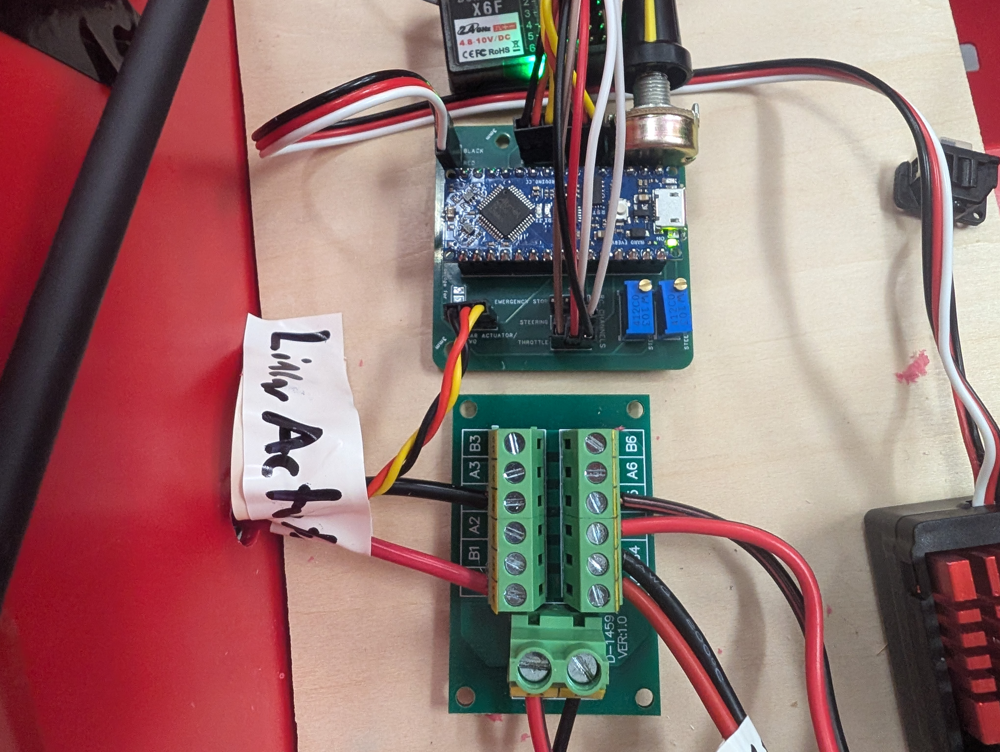

# GoBabyGo Joystick Project
### Wichita State University 2024
### Everett Kernen and Jackson Truitt
-----------
-----------

In this tutorial you will learn how to implement a joystick into your GoBabyGo vehicle for supporting children with motor or other disabilities.

## TODO
* add motor controller programmer details
* add linear actuator installation
* add images

You will need
-----------
### If you are at Wichita State, many of these components will already exist in the GoBabyGo room. Check before you purchase.
* [Vehicle](https://www.amazon.com/gp/product/B0C7JK9HNR/ref=ask_ql_qh_dp_hza?th=1)
     - This "Jeep" is the one we used and configured the steering mechanism for. Other ride-on vehicles we have seen use extremely similar electronics, so the only difference should be the steering.
* [Kill switch](https://www.amazon.com/Toggle-Switches-Rocker-Switch-Waterproof/dp/B07WW3WW3F)
* [Arduino Nano Every with headers](https://store-usa.arduino.cc/collections/boards-modules/products/arduino-nano-every-with-headers)
* [Motor Controller](https://www.amazon.com/HOBBYWING-QUICRUN-Waterproof-Brushed-Motors/dp/B07NYBF6MQ)
* [Motor Controller Programmer](https://www.hobbywingdirect.com/products/led-pc2c?variant=172030922)
     - The motor controller settings will be changed lower in this tutorial.
* [Linear Actuator](https://www.servocity.com/4-stroke-25-lb-thrust-linear-servo/)
     - At $300, this is by far the biggest opportunity we have to reduce costs. We are in the process of configuring [this servo,](https://www.amazon.com/GoolRC-Digital-Torque-Waterproof-Replacements/dp/B0B5H4MWZG) but that process is unfinished at this time.
* [Joystick](https://www.amazon.com/Acxico-Joystick-Potentiometer-JH-D202X-R2-Thermistor/dp/B09JZ8ZV4L)
* [RC Controller](https://www.amazon.com/DUMBORC-Transmitter-Receiver-Controller-400m-500m/dp/B07RR81GSB)
     - Used for parent override
* [30A bus bar](https://www.amazon.com/OONO-Position-Terminal-Distribution-Module/dp/B09D3BV22M)
* [4 foot servo wires](https://www.readymaderc.com/products/details/120cm-48in-jr-twisted-22awg-servo-cable?srsltid=AfmBOooBtGZkchE-u-FVPZSh1Mha9t9dLRYeGN2BnarDRjaqf-3A2QVKya4)
     - Quantity 2
* [Potentiometer - speed control](https://www.amazon.com/Uxcell-a15040700ux0380-Terminals-Linear-Potentiometer/dp/B019I13X5K)
* [Potentiometer - steering control](https://www.digikey.com/en/products/detail/bourns-inc/3296W-1-103LF/1088045)
     - Quantity 2
* [15 pin female header pins](https://www.amazon.com/2-54mm-Female-Single-Straight-Header/dp/B07VP63Z78)
     - Connect the arduino to the PCB
* [Male header pins](https://www.amazon.com/HiLetgo-20pcs-2-54mm-Single-Header/dp/B07R5QDL8D)
     - Connect everything else to the PCB
* [Spade connectors](https://www.amazon.com/Connectors-Shrink-Terminals-Female-MENTBERY/dp/B0BFDJNK91?source=ps-sl-shoppingads-lpcontext&ref_=fplfs&smid=A2TBO4E1CS6T20&th=1)
* PCB
     - You can upload the attached [gerber file](/GBG_Joystick_PCB_v4.zip) to a PCB manufacturer of your choice (PCBWay, JLCPCB, among others). You can also see and modify the [KiCAD files](/KiCAD/) and export from there.
     - Alternatively, you could build this on a breadboard or solder all wires together. If you do that, I highly recommend you reference the [schematic](/KiCAD/KiCAD.kicad_sch).
* Access to a soldering iron

## Starting here

After assembling your vehicle, the "engine bay" will look like this.

It looks like (and is) a jumbled mess of wires, but it's pretty easy to sort out.
Here are the components that are relevant to us.

## Step 1: Disassembly
1. Before you do anything, disconnect the battery, wires outlined in yellow.
2. Double check you've disconnected the battery. 
3. Disconnect the connector outlined in green. It heads to the rear motors which power the car.
4. Disconnect the connector leading to the steering motor. The connector is between the green and orange connectors and the wires are typically blue and brown.

## Step 2: Preparation and wiring power
Cut a small board to place all your components on. We used MDF, but it could be rigid cardboard.\
Gather your 30A bus, a spool of wire (14-18AWG), your kill switch, and your 30A bus.

### Preparation
1. Making sure once again that the orange wire is not connected on either side, cut it about three inches from the orange connector. 
2. Strip all four wires about a quarter of an inch
3. Take the red wire on the orange connector side and crimp on a spade connector that fits the wire guage. Once crimped, pull to make sure it is secure.
### Kill switch
4. Taking your spool of wire, strip the same amount from two wires and crimp the opposite spade connector on one. Again, pull to test it's secure, then connect it to the red wire we just crimped.
5. Run both spool wires from your spool to the rear of the car, running the wire along the bottom or side of the car to keep things neat and tidy. 
6. Use wire nuts or spade connectors to connect the wires to your kill switch.
7. Use a drill and the accompanying nuts that came with the switch to attach it securely to the rear of the car.
### 30A bus and motor controller
8. Coming back to the front, take the 30A bus and screw 1) the other wire from the kill switch and 2) the black wire on the orange connector side to the end of the bus. Note which letter is displayed. We used A for positive (red, going from battery positive to kill switch and back) and B for ground (black, battery negative).
9. Ensure the battery remains disconnected, if you connected it to test kill switch continuity.
10. Screw the power wires from the car controller (the other half of the orange wire) into the bus, ensuring A goes with A and B goes with B.
11. With your motor controller, cut and strip the red and black power wires and screw them into the bus.
12. Cut the connector (previously outlined in green) off the wires going to the rear motors. Strip both wires and crimp on spade connectors.
13. On the motor controller, cut and strip one yellow and one blue wire and crimp on the opposing spade connector.
14. Connect the motor controller and rear motor wires.

Now referencing our [KiCAD schematic](images/02_schematic.png), we've completed the following (outlined in blue).

## Step 3: Linear Actuator
### TODO

## Step 4: Joystick soldering
This soldering is easily the most difficult, so be prepared. We recommend grabbing some small heat shrink tubing to go over the wires to insulate and protect the connections.
1. Grab the joystick and two servo wires. Cut the wires and keep the female ends. We keep the female ends here because the 4 foot servo wires will connect their female ends to the male ends on the PCB.
2. Splice the wires, solder them to the joystick leads, and cover with heat shrink tubing.

## Step 5: PCB
1. Gather your PCB, two 15 pin female headers, seven 3 pin male headers, and all three potentiometers.

2. Solder all components on the underside. When soldering the arduino headers, we recommend putting the arduino into the headers to ensure the two headers stay aligned.

3. Open the [Arduino sketch](/Arduino/Arduino.ino) in the Arduino IDE and flash the sketch to your arduino

### 4. Plug in all components to the PCB!!

## Step 6: RC controls
Grab the RC receiver and place it near the PCB. Tape the antenna where there will be little interference. Run jumper wires from the receiver to the PCB, according to the below picture.

## Step 7: Fine tuning

### Potentiometers
Plug the joystick extension wires into the PCB. Ensure nothing looks terribly wrong, then plug the battery in and flip the kill switch on.

If nothing looks amiss, turn the joystick right/left front/back. Turn the joystick until the directions are correct. If one of the two axis are flipped, simply unplug the connector from the PCB, turn it around, and plug it in again.

The vehicle should now have steering and motors functional. To increase or reduce the speed, turn the speed potentiometer until you are satisfied.

Next, flip the car or get into a position you can see the steering. It is likely not centered, so turn the steering center adjustment potentiometer until it is centered. Finally, move the joystick all the way in both directions, and reduce or increase the steering range adjustment potentiometer until the vehicle has maximum turning ability without running into the wheels or steering rack, etc.

### RC controls
Test the RC controller. Ensure the trigger controls the motor, the wheel controls steering, and the emergency stop button works as intended. If it has a different range or center than the joystick, open the top flap and adjust the knobs until it is much closer.

## Troubleshooting
If the car does not move when turned on, check that the RC controller is on. Occasionally, the RC receiver may, on start, send a signal that the emergency stop is on. Turning the controller on sends the proper signal to the receiver and the vehicle is free to move.

Ensure all components are fully seated into their connectors

Ensure the solder joints on the PCB make a proper connection.

If none of these work or if the vehicle motors/steering is wonky, connect the arduino to your computer and read the Serial Monitor. Check that the values there match up generally to what's written in the code. If you have trouble parsing the code, please feel free to open an issue in this github repo.